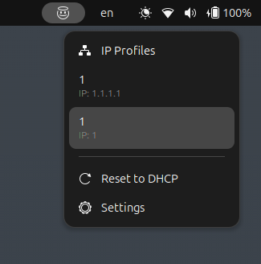
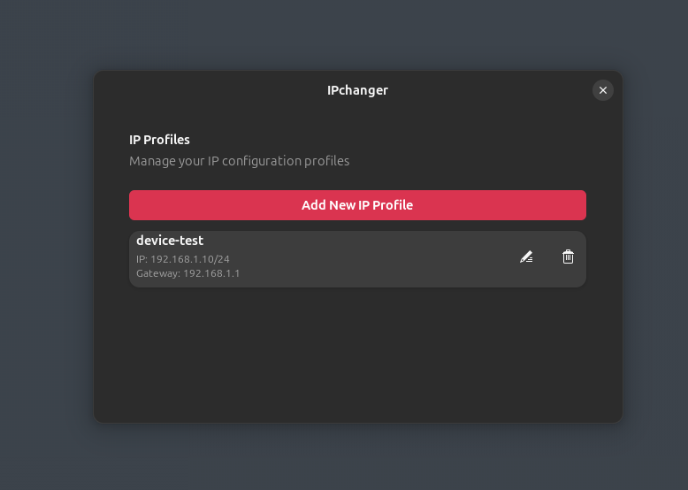
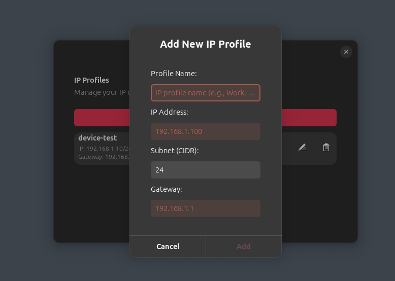

# IPchanger GNOME Shell Extension

A GNOME Shell extension to quickly switch between predefined IP profiles or revert to DHCP on your active network connection.







## 😎 Features

- Display a status icon in the GNOME top panel.
- Show a menu with configured IP profiles.
- Apply IP profile with static IP address, subnet mask, and gateway.
- Reset network configuration to DHCP.
- Open extension settings for managing profiles.
- Show notifications for success or failure of operations.

## 💡 Installation

1. Clone or download this extension's directory into your GNOME Shell extensions folder:

```bash
cd ~/.local/share/gnome-shell/extensions/ipchanger@rezabakhshi.github/
```

2. Enable the extension via GNOME Extensions app or

```bash
`gnome-extensions enable ipchanger@rezabakhshi.github`.
```

## 🔨 Usage

- Click the `😇 angel face ` icon in the top panel.
- Select an `IP profile` to apply a static IP.
- Select `Reset` to DHCP to switch back to DHCP.
- Select `Settings` to configure IP profiles.

## 📚 Requirements

1.  GNOME Shell with JavaScript (GJS) support.
2.  nmcli (NetworkManager command line tool).
3.  GNOME Extensions tooling (gnome-extensions).

## 🐛 Troubleshooting

- Ensure `nmcli` is installed and you have the required permissions.
- Active connection detection relies on `nmcli` output.
- Check GNOME Shell logs for errors
  ```bash
  journalctl /usr/bin/gnome-shell -f
  ```

## 🧑🏻‍💻 Author

> Reza Bakhshi (bakhshireza221@gmail.com)
